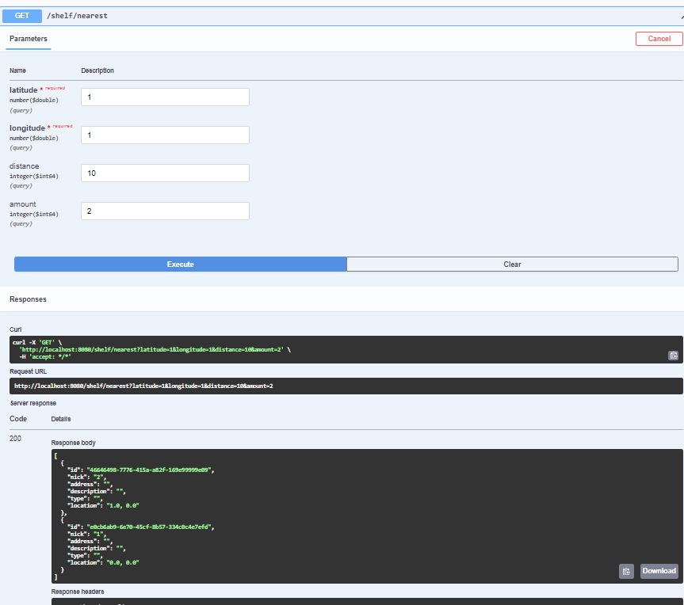

## BookShelf Service HW5
Связь tg: https://t.me/ivn_alxv

### Pre-requisites:
- Убедиться, что все зависимости корректно установлены
- Убедиться, что установлена системная переменная JAVA_HOME к OpenJDK 17+
- Можно также проверить, что сервис работает через [SwaggerUI](http://localhost:8080/swagger-ui/index.html#/)

## Проделанная работа:

Используя наработки прошлого HW, развернул приложение. После этого, следуя ТЗ сделал:

### Spring Probes

Сделал отдельный @RestController, также используя WebClient. Добавил системные эндпоинты, следуя [статье](https://spring.io/blog/2020/03/25/liveness-and-readiness-probes-with-spring-boot): 
- ``[host]:[port]/system/liveness`` - выдает liveness приложения
- ``[host]:[port]/system/readiness`` - выдает readiness приложения
- ``[host]:[port]/system/version`` - выдает version приложения


### DAO and DTO

Создал ``Depository``, и ``BookDepositDto``. Все поля сущности ``BookDepositDto`` удовлетворяют условиям ТЗ, именно она будет передаваться контроллером.

Также сделал ``DepositoryController``, отвечающий на запросы по ближайшим шкафам. 


### Requests

Возвращает {amount} ближайших хранилищ книг в радиусе {distance} к хранилищу с указанным {id}

```
@GetMapping("shelf/{id}/nearest")
public Flux<BookDepositDto> getNearest(
        @PathVariable UUID bookDepositId, 
        @RequestParam(required = false, defaultValue = "100") Long distance,
        @RequestParam(required = false, defaultValue = "50") Long amount,
){...}
```


Возвращает {amount} ближайших хранилищ книг в радиусе {distance} к указанным координатам определяемым {latitude} и {longitude}
переданными в параметрах запроса
```
@GetMapping("shelf/nearest")
public Flux<BookDepositDto> getNearest(
        @RequestParam Double latitude,
        @RequestParam Double longitude,
        @RequestParam(required = false, defaultValue = "250") Long distance,
        @RequestParam(required = false, defaultValue = "10") Long amount,
){...}
```

### Результат:

Примеры ответа сервера на запросы:

