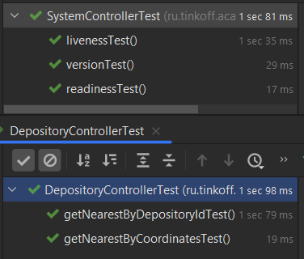
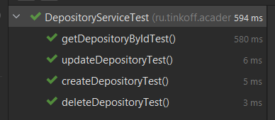

## BookShelf Service HW6
Связь tg: https://t.me/ivn_alxv

### Pre-requisites:
- Убедиться, что все зависимости корректно установлены
- Убедиться, что установлена системная переменная JAVA_HOME к OpenJDK 17+
- Можно также проверить, что сервис работает через [SwaggerUI](http://localhost:8080/swagger-ui/index.html#/)

## Проделанная работа:

Добавил тестирование для приложения Bookshelf.

### Результат:

Тесты контроллеров.

Тесты сервисов.

